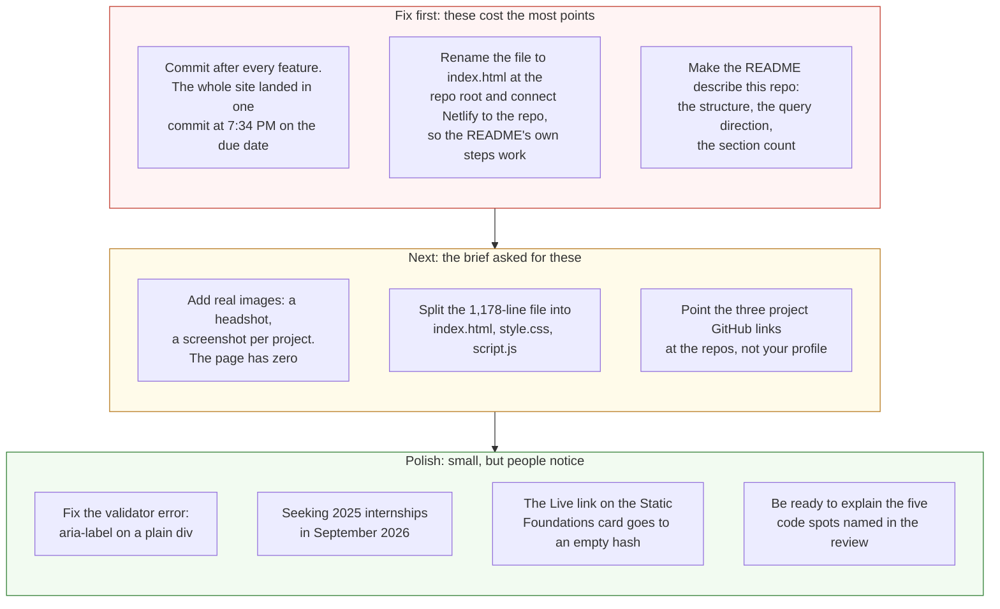

# Project 1: Static Foundations — Feedback

**Student:** Sahan Kumarage · **Repo:** [Sahan2004-06/CSC436](https://github.com/Sahan2004-06/CSC436) (folder `Project 1/`) · **Live:** [nimble-capybara-2af565.netlify.app](https://nimble-capybara-2af565.netlify.app/)
**Reviewed at commit:** `50b10e7` · **Course:** CSC 436, Fall 2026

> **How this review was made.** Your instructor reviewed this project with [Claude](https://claude.com) (Anthropic's AI) as a second set of eyes. Claude cloned the repo, read the whole 1,178-line file, loaded the live site at phone, tablet and desktop widths, ran the W3C validator, opened and closed the mobile drawer, clicked every filter button, scrolled to test the scroll spy, compared the live HTML to the repo byte for byte, and read the README against the code. Every note and every point below was read and approved by your instructor. Same standard, same rubric, just more time spent looking at *your* code than one human has in a grading week.

## Grade: 80 / 100

| Category | Points | Earned | One line |
|---|:-:|:-:|---|
| Semantic HTML | 20 | 18 | The most thorough markup in the class; one validator error and four links that go nowhere useful |
| CSS layout | 25 | 22 | 693 lines with tokens, Flexbox everywhere and three real Grids; all of it inline in the HTML, desktop-first |
| Responsive design | 15 | 13 | No horizontal scroll at any width, a real drawer, three breakpoints; `overflow-x: hidden` hides whatever might slip |
| JavaScript interaction | 15 | 14 | Scroll spy, drawer with Escape and focus return, tag filter with active state; all vanilla, all verified |
| Repository and deployment | 15 | 6 | The entire site in one commit at 7:34 PM on the due date; a README that describes a repo that doesn't exist |
| Content and polish | 10 | 7 | Real bio with a real voice; zero images, a 2025 date in 2026, project links to a profile |
| **Total** | **100** | **80** | **Excellent code. The repository around it is where the points went, and where the brief has a warning.** |

## The short version

The site is very well built. The markup has `aria-labelledby` on every section, `role="list"` where a reset would otherwise strip semantics, `aria-expanded` and `aria-controls` on the hamburger, a `role="group"` filter bar, and one `h1`. The CSS has a token block, twenty Flexbox rules, three Grids including an `auto-fit` gallery, `clamp()` type, and a `prefers-reduced-motion` block. The JavaScript has three interactions and every one of them works: Claude opened the drawer, filtered to Python and got the right two cards, scrolled to Projects and watched the nav light up.

Then there's the repository. Two commits, three minutes apart, at 7:34 PM on the due date. The first one is the whole site: 1,178 lines in one file. The brief, in bold, says a single last-minute commit containing the whole project loses repository points and triggers an academic integrity review. Your instructor will follow up on the second part. This review handles the first.

The README makes it worse, not better. It describes `index.html` at the repo root, says Netlify will find it automatically, says the CSS is mobile-first, and counts four sections. The repo has `Project 1/Personal Project 1.html`, no `index.html`, three `max-width` queries, and five sections. The README is a good document about a different repository.

## What the numbers looked like

Things Claude measured (so you know these aren't guesses):

| Check | Result |
|---|---|
| Horizontal scroll at 375 / 768 / 1024 / 1280 px | None at any width |
| W3C HTML validator | 1 error: `aria-label` on a plain `div` (line 760) |
| Heading order | h1 → h2 → h3, no skipped levels |
| Semantic elements | `header`, 2 `nav`, `main`, 5 `section`, 4 `article`, `footer` |
| Mobile drawer | Opens with 4 links, `aria-expanded` and label flip, closes on link tap and Escape |
| Filter: python / all | 2 / 4 cards, active class moves correctly |
| Scroll spy | Highlights "Projects" when scrolled there; never reaches "Contact" (last section is shorter than the viewport) |
| Console errors | 0 |
| Images on the page | 0 |
| Links: project "GitHub" | 3, all to your profile, not a repository |
| Links: "Live" on the Static Foundations card | `href="#"` |
| Live HTML vs repo file | Identical |
| Files in repo | 2: `Project 1/README.md`, `Project 1/Personal Project 1.html` |
| Commits | 2, both on Sep 15 between 7:34 PM and 7:37 PM; the first is the entire site |
| README claims vs repo | `index.html` at root (no), mobile-first (no), 4 sections (5) |

---

## Semantic HTML — 18 / 20

**What's working**

- This is the most careful markup submitted so far. `header > nav` with `aria-label`, a real `ul > li > a` with `role="list"` so the CSS reset doesn't strip list semantics, a hamburger `button` with `aria-expanded` and `aria-controls`, every section labelled by its own heading via `aria-labelledby`, `article` for each project card, a `role="group"` on the filter bar, a second `nav` in the footer with its own label, `rel="noopener noreferrer"` on every external link. One `h1` with the role in a `span` ([line 765](https://github.com/Sahan2004-06/CSC436/blob/50b10e7/Project%201/Personal%20Project%201.html#L765)). A meta description. The validator finds one thing in 1,178 lines.

**What to change**

- **The one validator error.** [Line 760](https://github.com/Sahan2004-06/CSC436/blob/50b10e7/Project%201/Personal%20Project%201.html#L760): `<div class="hero-status" aria-label="…">`. A `div` has no role, so ARIA says it can't carry a label. Either give it `role="status"` (which is what it is) or drop the attribute; the visible text already says it.
- **Four links go nowhere useful.** The three project "GitHub" links all point at `https://github.com/Sahan2004-06`, your profile, not the project. If PassGuard and HashVault have repos, link them. If they don't yet, say "coming soon" instead of linking. And the "Live" link on the Static Foundations card is `href="#"`; you're already on it, so link the section or drop the link.
- Small: the mobile drawer is a `div role="dialog"`. A dialog traps focus and has a name; yours is really a second `nav`. `<nav aria-label="Mobile navigation">` is the honest element and needs no role.

## CSS layout — 22 / 25

**What's working**

- **A real design system:** 14 tokens for color, type, width and radius ([lines 18–32](https://github.com/Sahan2004-06/CSC436/blob/50b10e7/Project%201/Personal%20Project%201.html#L18-L32)), used consistently. Twenty Flexbox rules doing layout: the nav, hero actions, skills cards, stat cards, project card headers, the footer (copyright left, links right, wrapping under 768px). Three Grids: the About two-column, a nested 2×2 stat grid, and `repeat(auto-fit, minmax(…))` for projects. `clamp()` on headings. A `prefers-reduced-motion` block that zeroes every animation. Zero `!important` outside that block.

**What to change**

- **Everything is in one file.** 693 lines of CSS and 107 lines of JavaScript live inside `Personal Project 1.html`. It works, but the brief was called Static Foundations for a reason: `index.html`, `style.css`, `script.js` is the foundation. It's also what your own README says the structure is. Split them.
- **Desktop-first, while the README says mobile-first.** All three width queries are `max-width` ([657](https://github.com/Sahan2004-06/CSC436/blob/50b10e7/Project%201/Personal%20Project%201.html#L657), [680](https://github.com/Sahan2004-06/CSC436/blob/50b10e7/Project%201/Personal%20Project%201.html#L680), [693](https://github.com/Sahan2004-06/CSC436/blob/50b10e7/Project%201/Personal%20Project%201.html#L693)). The brief asked for mobile-first. Either flip the queries or fix the README; right now they disagree.
- **`overflow-x: hidden` on `body`** ([line 52](https://github.com/Sahan2004-06/CSC436/blob/50b10e7/Project%201/Personal%20Project%201.html#L52)). Claude turned it off at four widths and nothing overflowed, so you don't need it. Delete it. If something ever does overflow, you want to see it, not hide it.

## Responsive design — 13 / 15

**What's working**

- No horizontal scroll at 375, 768, 1024 or 1280. The hero stacks its buttons under 480px, the About grid drops to one column, the projects grid goes from two columns to one, the footer stacks and centers, and the nav collapses to a drawer that Claude opened and closed. `100svh` on the hero, which is the correct unit for phones with a moving address bar. This is a responsive site.

**What to change**

- **Desktop-first** (see CSS). The brief asked for the other direction, and your README claims the other direction.
- **`overflow-x: hidden`** is a safety net you don't need. Remove it and you'll know for certain the layout holds.

## JavaScript interaction — 14 / 15

**What's working**

- **Three interactions, all verified.** The scroll spy ([lines 1081–1102](https://github.com/Sahan2004-06/CSC436/blob/50b10e7/Project%201/Personal%20Project%201.html#L1081-L1102)) toggles a `.scrolled` class on the nav and moves `.active` to the link for the section at the top of the viewport, with a `passive` listener. The drawer ([1110–1147](https://github.com/Sahan2004-06/CSC436/blob/50b10e7/Project%201/Personal%20Project%201.html#L1110-L1147)) flips `aria-expanded` and the label, animates the bars, closes on link tap and on Escape, and returns focus to the button, which most professional sites don't bother with. The tag filter ([1156–1174](https://github.com/Sahan2004-06/CSC436/blob/50b10e7/Project%201/Personal%20Project%201.html#L1156-L1174)) moves the active class and toggles `.hidden` by splitting `data-tags`. `'use strict'`. Zero console errors.

**What to change**

- **"Contact" never lights up.** The scroll spy marks a section active when its top passes 80px, but the Contact section is shorter than the viewport, so the page can't scroll far enough for that to happen. Claude scrolled to the bottom and "Projects" stayed active. The usual fix: if the page is scrolled to the bottom, activate the last section.
- Small: the hamburger animation writes inline `transform` and `opacity` from JS ([1118–1120](https://github.com/Sahan2004-06/CSC436/blob/50b10e7/Project%201/Personal%20Project%201.html#L1118-L1120)). You already toggle `.open` on the drawer; toggle it on the button too and let CSS animate the bars. Behavior in JS, appearance in CSS.
- On the "explain every line" rule. There is no AI log with this submission, and the code is polished enough that the question will come up. Be ready to explain these five in office hours: why `rect.top <= 80` picks the current section ([1089](https://github.com/Sahan2004-06/CSC436/blob/50b10e7/Project%201/Personal%20Project%201.html#L1089)); what `{ passive: true }` does on [1101](https://github.com/Sahan2004-06/CSC436/blob/50b10e7/Project%201/Personal%20Project%201.html#L1101); how `aria-controls` and `aria-expanded` work together on the toggle; what `tags.split(' ').includes(selected)` returns on [1170](https://github.com/Sahan2004-06/CSC436/blob/50b10e7/Project%201/Personal%20Project%201.html#L1170); and what `scroll-padding-top: var(--nav-h)` on [line 42](https://github.com/Sahan2004-06/CSC436/blob/50b10e7/Project%201/Personal%20Project%201.html#L42) fixes.

## Repository and deployment — 6 / 15

**What's working**

- The live site matches the repo file byte for byte, and loads in a private window. The README has a title, a description, run instructions, the live URL, and a requirements table, which is more than the brief asked for.

**What to change**

- **The whole site is one commit.** `68cf4f1`, "Added Project 1.", 1,257 lines across two files at 7:34 PM on September 15. Three minutes later, a README URL fix. That's the history. The brief said, in bold: "A single last-minute commit containing the whole project will lose repository points and triggers an academic integrity review." This is that case. The repository points are handled here; the review is your instructor's.

  ```mermaid
  flowchart TB
      subgraph yours["Your repo: 2 commits, 3 minutes apart, Sep 15 at 7:34 PM"]
          direction LR
          a["68cf4f1<br/>Added Project 1.<br/><b>+1,257 lines: the entire site</b><br/>in one 1,178-line file"] --> b["50b10e7<br/>Change live URL in README<br/>2 lines"]
      end
      subgraph brief["What the brief asks for: small commits across Sep 1 to 15"]
          direction LR
          c["add page skeleton"] --> d["add flexbox nav"] --> e["add about grid"] --> f["add project cards"] --> g["add tag filter"] --> h["add mobile drawer"] --> i["add README"]
      end
      warn["The brief, in bold: a single last-minute commit containing<br/>the whole project loses repository points and triggers<br/>an academic integrity review."]
      yours -.-> brief
      yours --> warn
      style a fill:#fde2e2,stroke:#c0392b,color:#111
      style b fill:#fff4d6,stroke:#b7791f,color:#111
      style c fill:#e3f4e1,stroke:#2e7d32,color:#111
      style d fill:#e3f4e1,stroke:#2e7d32,color:#111
      style e fill:#e3f4e1,stroke:#2e7d32,color:#111
      style f fill:#e3f4e1,stroke:#2e7d32,color:#111
      style g fill:#e3f4e1,stroke:#2e7d32,color:#111
      style h fill:#e3f4e1,stroke:#2e7d32,color:#111
      style i fill:#e3f4e1,stroke:#2e7d32,color:#111
      style warn fill:#fff4d6,stroke:#b7791f,color:#111
  ```

- **The README describes a different repository.** It says the structure is `/index.html` and `/README.md`. It says to import the repo into Netlify and "Netlify finds `index.html` automatically." It says the CSS is mobile-first. It says there are four sections. The actual repo is a `Project 1/` folder containing `Personal Project 1.html` (spaces in both names) and no `index.html` at all, so Netlify could not have deployed it the way the README describes; the live site had to be uploaded some other way. The queries are `max-width`. There are five sections. A README that doesn't match its repo is worse than a short one, because a reader trusts it.

  ```mermaid
  flowchart LR
      subgraph readme["What the README says"]
          direction TB
          r1["Project structure:<br/>index.html at the root"]
          r2["Deploy: import the repo, Netlify<br/>finds index.html automatically"]
          r3["Responsive: mobile-first"]
          r4["Semantic: 4 sections"]
      end
      subgraph repo["What is actually in the repo"]
          direction TB
          p1["Project 1/Personal Project 1.html<br/>a subfolder and a filename with spaces.<br/>No index.html anywhere."]
          p2["Netlify cannot find index.html here.<br/>The live site had to be uploaded<br/>some other way."]
          p3["All three width queries are max-width:<br/>desktop-first"]
          p4["5 sections"]
      end
      r1 --> p1
      r2 --> p2
      r3 --> p3
      r4 --> p4
      style r1 fill:#fff4d6,stroke:#b7791f,color:#111
      style r2 fill:#fff4d6,stroke:#b7791f,color:#111
      style r3 fill:#fff4d6,stroke:#b7791f,color:#111
      style r4 fill:#fff4d6,stroke:#b7791f,color:#111
      style p1 fill:#fde2e2,stroke:#c0392b,color:#111
      style p2 fill:#fde2e2,stroke:#c0392b,color:#111
      style p3 fill:#fde2e2,stroke:#c0392b,color:#111
      style p4 fill:#fde2e2,stroke:#c0392b,color:#111
  ```

- **Rename and reconnect.** Move the file to `index.html` at the repo root (or set the Netlify base directory to `Project 1` and name the file `index.html` there), connect Netlify to the repo, and every push will deploy. That's what the brief asked for, and it's what your README already says you did.

## Content and polish — 7 / 10

**What's working**

- The bio is real and it has a voice: self-funding a degree through food-service work, Network+ in progress, the D.C. corridor as a target, Sri Lankan cricket and *Dune Messiah*. The stat cards turn that into something scannable. The design is consistent from the monospace eyebrow to the gold accent. Nothing here is placeholder text.

**What to change**

- **Zero images.** The brief asked for real text and images that fit the theme, and the page has none. A headshot in the About grid and a screenshot per project card would fill the two places that are visibly waiting for them.
- **"Seeking 2025 internships"** in a site graded in September 2026 ([line 762](https://github.com/Sahan2004-06/CSC436/blob/50b10e7/Project%201/Personal%20Project%201.html#L762)). The status pill is the first thing a recruiter reads. Keep it current.
- The project links go to a profile and a `#`. A recruiter who clicks "GitHub" on PassGuard and lands on your profile page assumes the project doesn't exist.

---

## Your next three moves



1. **Make the repo match the README, then make it deploy.** `index.html` at the root, `style.css` and `script.js` beside it, Netlify connected to the repo. That's three commits right there, which is already more history than you have.
2. **Commit as you go on Project 2.** Ten to twenty commits over two weeks. The brief's warning about a single commit is the one rule in this course with an integrity consequence attached.
3. **Add images and fix the four links.** A headshot, four screenshots, three real repo URLs. Then the content matches the quality of the code.

The code in this file is strong. Make the repository around it just as honest, and be ready to walk through the five spots above.

*This PR only adds feedback files. It does not touch your code. Merge it, close it, or just read it, your call. Questions go to office hours or the Brightspace board.*
